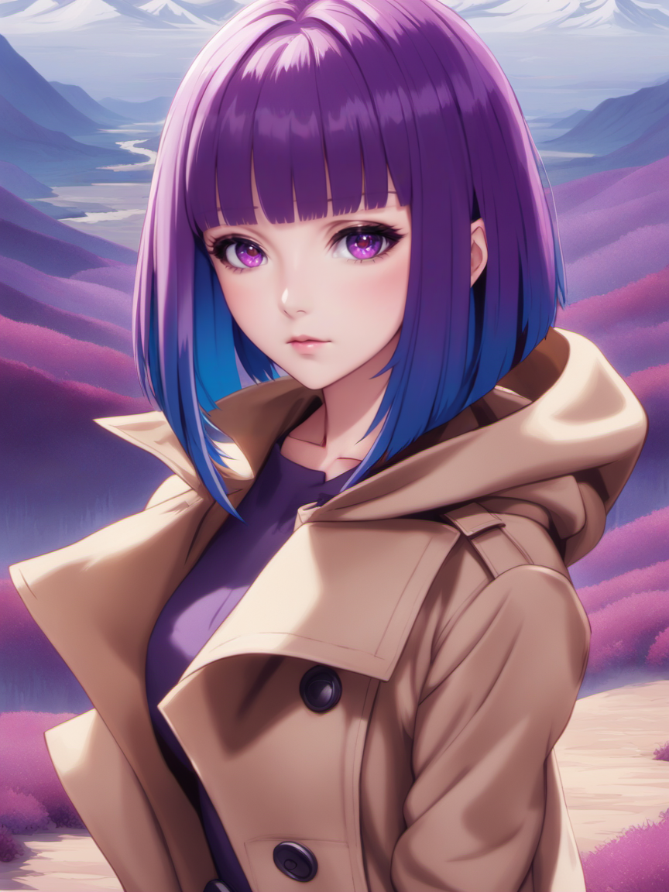
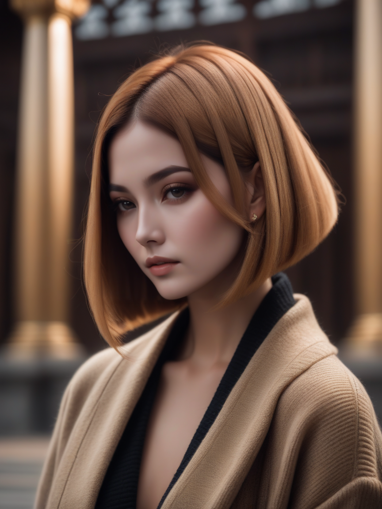

# LoRA - Sliced Bob Hairstyle

Open-sourced LoRA configuration and training data for Stable Diffusion XL.

| `animeArtDiffusionXL_alpha3`                           | `dreamshaperXL10_alpha2Xl10`                                        |
|---------------------------------|----------------------------------------------|
|  |  |

_Who was Bob anyway?_

**This is an SDXL Lora. For the SD1.5 equivalent, see**: https://github.com/n15g/lora-sliced-bob

A model for producing variations of the bob hairstyle with blunted bangs and a very sharp cut around the shoulders.

https://civitai.com/models/162403/xl-sliced-bob

## Parameters

Recommended weight: `0.8`

Activation tags: `sliced bob`

Secondary tags:
* `<color> hair`
* `big hair` for more volume
* `[short|medium|long] hair` to a degree.

## Version History

| `XYZ0`                | `XYZ1`                |
|-----------------------|-----------------------|
|  |  |

#### v1.0

* Release

## Training

* Load config into [Kohya SS](https://github.com/bmaltais/kohya_ss)
* Download a base model.
* Download or create regularization images for the chosen model.
  For SDXL Base 1.0 use [reg-sdxl-1girl](https://github.com/n15g/reg-sdxl-1girl).
* Update paths for the model, image, output and logging folders
* Adjust the batch size for your GPU

| VRAM       | 24 GiB | 12 GiB | 8GiB |
|------------|--------|--------|------|
| Batch Size | 10     | 4      | 2-3  |
